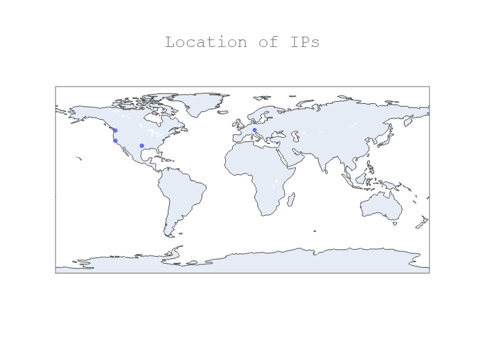

# pcap2map
### Place IP's from PCAP on world map

This package enables a user to specify a network traffic file (i.e. 
a packet capture or .pcap file), extract the IP addresses from that
file, geo-locate those addresses using a built-in database, and 
then place those IP's on a world map (a .png file).



Notes:
* The geolocation is done via a database provided by IP2Location.com. The database is included as part of the package.
* Only public IP's are extracted
* Typical runtime is 10 seconds for a small .pcap file
* There are many pre-existing packages that geo-locate IP's but none that extract IP's from a .pcap. pcap2map solves the latter problem
* pcap2map was written to be cross-platform
* pcap2map was written with Python 3.7

Dependencies:
* Wireshark - pyshark, a Python packet parsing module, relies on Wireshark. Wireshark download instructions can be found [here](https://tshark.dev/setup/install/)
* orca - The visualization and mapping of the geo-located IP addresses relies on plotly, to include a package called orca. Orca ownload instructions can be found [here](https://github.com/plotly/orca)

## Installation instructions

via github:
```
git clone https://github.com/jspeed-meyers/pcap2map
pip install -r requirements.txt
```

via PYPI:
```
pip install pcap2map
```

Note on Docker: Not currently available. The current Dockerfile file does not work.

## Usage instructions

after dowloading from github:
```
cd pcap2map\src\pcap2map
pcap2map.py [filepath\filename]

# Additionally, you can build and install the package
cd pcap2map
python setup.py sdist bdist_wheel
python setup.py install
python -m pcap2map -h  # for help
python -m pcap2map [filename]
```

after downloading from pip:
```
python -m pcap2map -h  # for help
python -m pcap2map [filename]
```

## Run tests

after downloading from github:
```
cd pcap2map\src\pcap2map
pytest
```
